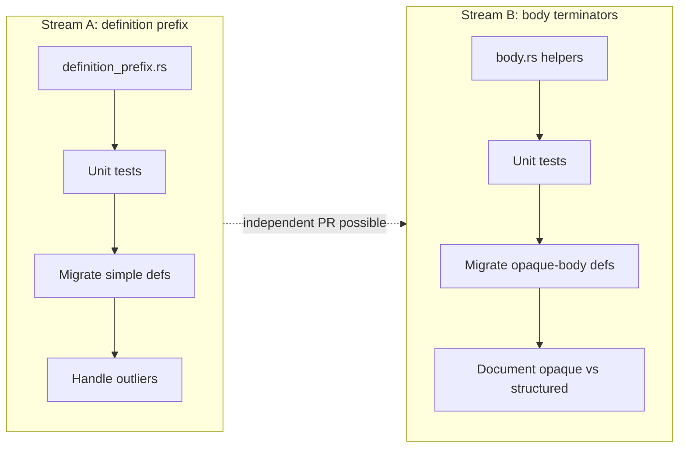

# Plan: P1 parser technical debt (definition prefix + body terminators)

This plan addresses the **P1** items from [`PARSER_TECHNICAL_DEBT.md`](./PARSER_TECHNICAL_DEBT.md). Scope is deliberately narrow: shared parsing primitives and migration of call sites, **without** AST redesign, unified KerML grammar (P3), or package-dispatch refactor (P2).

## Goals

| Goal | Success criterion |
|------|-------------------|
| Single place for definition prelude parsing | `abstract` / keyword / `def` / `identification` / header-after-ident live in one module |
| Single place for simple body terminators | Opaque `;` / `{ skip }` bodies use shared helpers; list of families documented |
| No regression on validation | `cargo test` and `cargo test -- --include-ignored` stay green |
| No regression on library gates | `ExtendedLibraryDecl` count remains 0 in systems + full library node-shape tests |
| Easier future header fixes | Changing typed-header behavior touches `specialization.rs` only, not ~18 files |

## Non-goals (this plan)

- Changing public AST shapes or merging `*Def` structs
- Replacing `skip_until_brace_end` with full body member parsing (P3)
- `parse_body_members` recovery abstraction (P2)
- Refactoring `package_body_element` (P2)
- Bumping crate version / CHANGELOG unless you cut a release after merge

## Work streams



Streams A and B can land as **two PRs** (A first recommended) or one PR if preferred.

---

## Stream A: `parse_definition_prefix`

### Problem

~18 definition parsers repeat the same prelude before `parse_optional_definition_header_after_identification`. Variants differ only by options; outliers (`connection_def` annotation, `constraint_def` duplicate `private`, `allocation_def` no leading `ws` pattern) need explicit handling.

### New module: `src/parser/definition_prefix.rs`

**Types**

```rust
pub struct DefinitionPrefixOptions {
    pub keyword: &'static [u8],           // e.g. b"item"
    pub def: DefKeywordMode,              // Required | Optional | Absent
    pub abstract_allowed: bool,
    pub visibility: VisibilityPrefix,     // None | Private (optional duplicate tolerated during migration)
    pub annotation: AnnotationMode,       // None | HashIdentifier (connection)
}

pub enum DefKeywordMode {
    Required,
    Optional,  // library: connection def / connection
    Absent,    // rare; prefer Optional for SysML
}

pub struct DefinitionPrefixResult {
    pub identification: Identification,
    pub specializes: Option<String>,
    pub specializes_span: Option<Span>,
    pub annotation: Option<String>,       // only when AnnotationMode::HashIdentifier
}
```

**Function**

```rust
pub(crate) fn parse_definition_prefix(
    input: Input<'_>,
    options: DefinitionPrefixOptions,
) -> IResult<Input<'_>, DefinitionPrefixResult>
```

**Behavior (order)**

1. `ws_and_comments`
2. Optional `#name` when `AnnotationMode::HashIdentifier`
3. Optional `abstract` when `abstract_allowed`
4. Optional `private` when configured (see constraint outlier below)
5. `tag(keyword)` + `ws1`
6. `def` per `DefKeywordMode`
7. `identification`
8. `parse_optional_definition_header_after_identification` → fill `specializes` / `specializes_span`

Export from `mod.rs`; keep `specialization.rs` focused on header/subclassification only.

### Migration matrix (definition parsers)

Migrate in **batches**; run full validation after each batch.

| Module | `def` | `abstract` | Notes |
|--------|-------|------------|-------|
| `item.rs` | Optional | Yes | Pilot after API exists |
| `individual.rs` | Optional | Yes | Same as item |
| `interface.rs` | Optional | Yes | |
| `port.rs` | Required | Yes | `def` required |
| `connection.rs` | Optional | Yes | + `#` annotation; pilot outlier in batch 2 |
| `constraint.rs` | Optional | Yes | + optional `private` (fix duplicate `private` parse while here) |
| `metadata.rs` | Optional | ? | Read current parser |
| `occurrence.rs` | Optional | ? | |
| `state.rs` | Optional | ? | |
| `flow.rs` | Required | No | No `abstract` in current `flow_def` |
| `allocation.rs` | Required | No | |
| `case.rs` | Per-case | Per-case | 3 defs; may need thin wrappers |
| `view.rs` | Per def | Per def | view / viewpoint / rendering |
| `requirement.rs` | Optional | Yes | |
| `usecase.rs` | Optional | Yes | |
| `enumeration.rs` | Required | ? | |
| `action.rs` | Optional | Yes | Larger file; migrate `action_def` only in A |
| `calc_def` in `constraint.rs` | Defer | Defer | Different prelude (`calc`); out of scope unless trivial |

**Out of scope for Stream A (keep local prelude)**

- `part_def` — disambiguation with `part_usage`, extra prefixes
- `alias_def`, `dependency`, `enum` body shape
- Usage parsers (`*_usage`)

### Tests (Stream A)

| Test | Location |
|------|----------|
| `abstract` + optional `def` + ident + `:> Base` | `definition_prefix.rs` unit tests |
| Typed header `: T[m] :> a, b` | Reuse / extend `specialization.rs` tests |
| `#anno abstract connection foo` | `definition_prefix.rs` |
| Existing `part_defs_accept_multiple_specialization_targets` etc. | `parser_tests.rs` — must still pass |
| Full validation + library node-shape | CI / local `--include-ignored` |

### Stream A tasks (checklist)

1. [ ] Add `definition_prefix.rs` + `DefinitionPrefixOptions` + `parse_definition_prefix`
2. [ ] Unit tests for standard and library-shorthand preludes
3. [ ] Migrate batch 1: `item`, `individual`, `interface`, `metadata` (optional def + abstract)
4. [ ] Migrate batch 2: `connection`, `constraint`, `port`, `requirement`
5. [ ] Migrate batch 3: `state`, `occurrence`, `flow`, `allocation`, `case`, `view`, `usecase`, `enumeration`, `action_def`
6. [ ] Remove duplicated prelude lines; fix `constraint_def` double-`private` bug if still present
7. [ ] Update `PARSER_TECHNICAL_DEBT.md` — mark P1 prefix as done

**Estimated effort:** 1–2 days focused work + CI time.

---

## Stream B: Shared body terminators

### Problem

At least `flow.rs`, `allocation.rs`, and `metadata.rs` define identical local `definition_body()` using `DefinitionBody::Semicolon` and opaque `DefinitionBody::Brace` via `skip_until_brace_end`. Other modules duplicate similar `alt(semicolon, brace)` with **structured** member loops (not identical — do not force one helper on those yet).

### New module: `src/parser/body.rs`

**Opaque body (P1 scope)**

```rust
/// `;` or `{` ... `}` with inner content skipped (no member AST).
pub(crate) fn semicolon_or_opaque_brace_body(
    input: Input<'_>,
) -> IResult<Input<'_>, DefinitionBody>
```

Implementation: move the exact pattern from `flow.rs` / `allocation.rs` (ws, `;` or delimited `{`, `skip_until_brace_end`, `}`).

**Structured body (optional stretch in P1)**

Only add if a second copy-paste is trivial to parameterize:

```rust
pub(crate) fn semicolon_or_structured_brace_body<E>(
    input: Input<'_>,
    starters: &[&[u8]],
    parse_element: impl FnMut(Input<'_>) -> IResult<Input<'_>, Node<E>>,
) -> IResult<Input<'_>, Either<DefinitionBody, BraceBody<E>>>
```

If this requires fighting heterogeneous `*DefBody` enums, **defer structured helper to P2** and only ship `semicolon_or_opaque_brace_body` in P1.

### Migration matrix (opaque bodies)

| Module | Local `definition_body` | Action |
|--------|-------------------------|--------|
| `flow.rs` | Yes | Replace with `semicolon_or_opaque_brace_body` |
| `allocation.rs` | Yes | Replace |
| `metadata.rs` | Yes | Replace |
| `occurrence.rs` | Check | Migrate if identical |
| `alias.rs` / `import.rs` | Different shapes | Document only; no change |

Add section in `PARSER_TECHNICAL_DEBT.md` or `body.rs` module doc:

**Families using opaque brace bodies (June 2026):** flow, allocation, metadata, …

### Tests (Stream B)

| Test | Location |
|------|----------|
| `;` only | `body.rs` unit test |
| `{ doc /* x */ }` skips inner | `body.rs` unit test |
| Existing flow/allocation/metadata tests | `parser_tests` / validation — unchanged behavior |

### Stream B tasks (checklist)

1. [ ] Add `body.rs` with `semicolon_or_opaque_brace_body`
2. [ ] Unit tests
3. [ ] Migrate `flow`, `allocation`, `metadata` (and any other identical copies found via ripgrep)
4. [ ] Document opaque-body family list
5. [ ] Update `PARSER_TECHNICAL_DEBT.md` — mark P1 body terminators as done

**Estimated effort:** 0.5–1 day.

---

## Delivery order

| Phase | Deliverable | PR suggestion |
|-------|-------------|---------------|
| **1** | Stream A API + tests + batch 1 migration | `refactor(parser): shared definition prefix (batch 1)` |
| **2** | Stream A batches 2–3 | `refactor(parser): migrate defs to definition prefix` |
| **3** | Stream B opaque body helper + migration | `refactor(parser): shared opaque definition body` |

Optional: combine phases 2+3 if diff stays reviewable (&lt; ~800 lines changed).

## Acceptance criteria (whole P1 plan)

- [ ] All existing `cargo test` tests pass
- [ ] `cargo test -- --include-ignored` passes (validation + library gates)
- [ ] `cargo clippy -- -W clippy::all` clean (or no new warnings)
- [ ] No increase in `ExtendedLibraryDecl` in `test_systems_library_node_types_no_extended` / `test_full_library_node_types_no_extended`
- [ ] At least 4 new unit tests on shared primitives (prefix + body)
- [ ] `PARSER_TECHNICAL_DEBT.md` updated with completion status and opaque-body list

## Risks and mitigations

| Risk | Mitigation |
|------|------------|
| One outlier def breaks library gates | Migrate in batches; run `--include-ignored` after each batch |
| `DefinitionPrefixOptions` becomes a flag dump | Keep outliers as local preludes + `parse_definition_prefix` for the 80% case |
| Structured body helper over-generalized | Ship opaque helper only in P1; defer structured loop to P2 |
| `connection` annotation lost in refactor | Dedicated test + migrate connection in batch 2 with annotation option |

## After P1 (pointer to P2)

When P1 is done, the next plan slice should cover:

1. **`parse_body_members`** with recovery (P2) — start with `requirement` or `constraint` body
2. **Keyword-group package dispatch** (P2) — only if adding new package members becomes painful

Do not start P3 (unified typing/multiplicity header) until P1 is merged and stable on `main`.

## References

- [`PARSER_TECHNICAL_DEBT.md`](./PARSER_TECHNICAL_DEBT.md) — overview and priorities
- [`src/parser/specialization.rs`](../src/parser/specialization.rs) — `parse_optional_definition_header_after_identification` (already landed)
- [`SYSML_V2_COMPLIANCE_GAP.md`](./SYSML_V2_COMPLIANCE_GAP.md) — grammar depth vs maintainability
